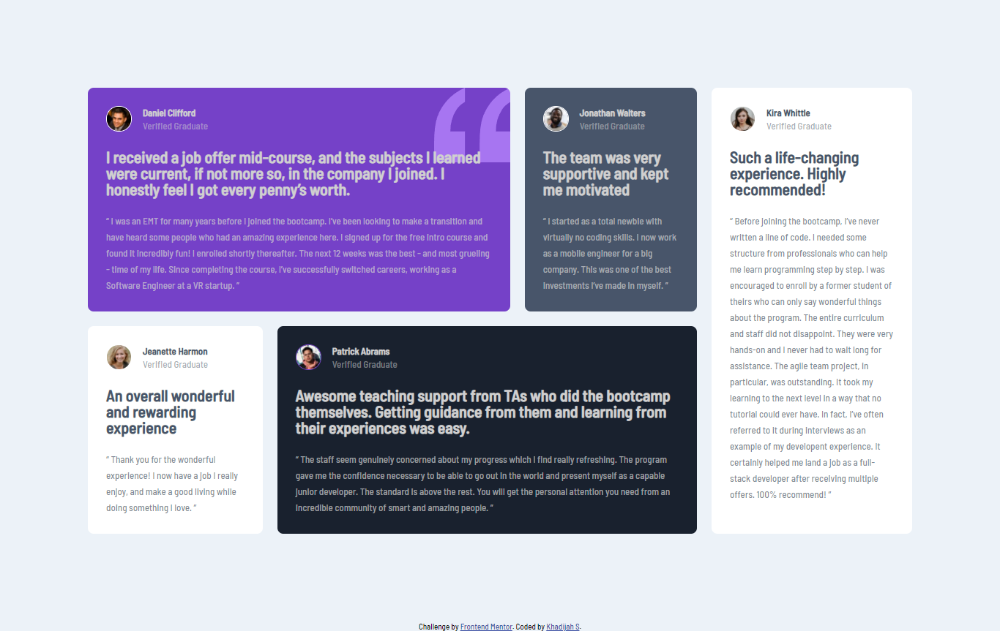

# Frontend Mentor - Testimonials grid section solution

This is a solution to the [Testimonials grid section challenge on Frontend Mentor](https://www.frontendmentor.io/challenges/testimonials-grid-section-Nnw6J7Un7). Frontend Mentor challenges help you improve your coding skills by building realistic projects. 

## Table of contents

- [Frontend Mentor - Testimonials grid section solution](#frontend-mentor---testimonials-grid-section-solution)
  - [Table of contents](#table-of-contents)
  - [Overview](#overview)
    - [The challenge](#the-challenge)
    - [Screenshot](#screenshot)
    - [Links](#links)
  - [My process](#my-process)
    - [Built with](#built-with)
    - [What I learned](#what-i-learned)
    - [Useful resources](#useful-resources)
  - [Author](#author)


## Overview

### The challenge

Users should be able to:

- View the optimal layout for the site depending on their device's screen size

### Screenshot




### Links

- Solution URL: (https://www.frontendmentor.io/solutions/testimonialsgridsection-using-css-grid-AGUNk_98p)
- Live Site URL: (https://khadijahs94.github.io/testimonials-grid-section/)

## My process

### Built with

- Semantic HTML5 markup
- CSS custom properties
- Flexbox
- CSS Grid

### What I learned

I learned how to use the css grid property.

```css
.proud-of-this-css {
  .grid-container {
    display: grid;
    justify-self: center;
    align-self: center;
    grid-template-areas:
      'daniel daniel daniel daniel jonathan kira'
      'jeanette patrick patrick patrick patrick kira';
    grid-gap: 20px;
    padding: 80px;
    margin: 40px;
    background-color: hsl(210, 46%, 95%);
}
}
```


### Useful resources

- [Example resource 1](https://www.w3schools.com/default.asp) - This helped me create grids.

## Author

- Frontend Mentor - [@KhadijahS94](https://www.frontendmentor.io/profile/KhadijahS94)
- Twitter - [@The_Brown_One_](https://www.twitter.com/The_Brown_One_)
